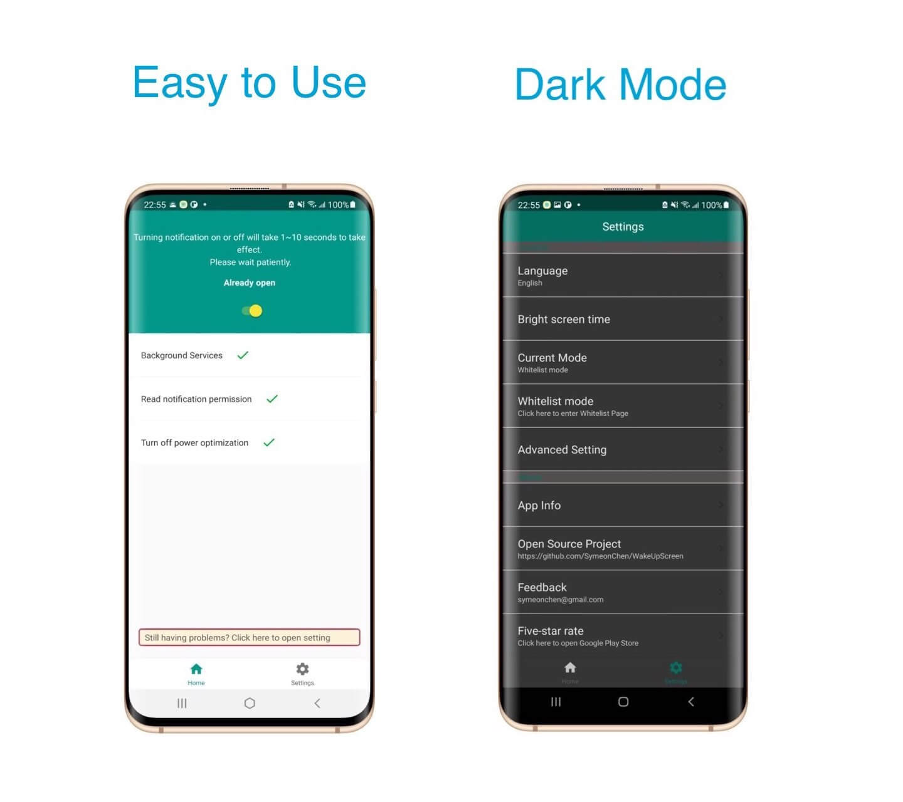

* [English Version](https://github.com/SymeonChen/WakeUpScreen/blob/master/README.md)
* [Italian Version](https://github.com/SymeonChen/WakeUpScreen/blob/master/README-it.md)
* [中文版](https://github.com/SymeonChen/WakeUpScreen/blob/master/README-zh.md)

# WakeUpScreen

 
Questa è un applicazione Android che permette al telefono di risvegliarsi quando riceve una notifica.
Ottimizzato specialmente per il Samsung S10. Compatibile con altri dispositivi.
 

  

## Screenshots

## Caratteristiche

1. Open source.
2. Nessun accesso a internet.
3. Supporto al Pocket Mode.
4. Supporto agli elenchi di APP usati.
5. Supporto agli orari personalizzati.