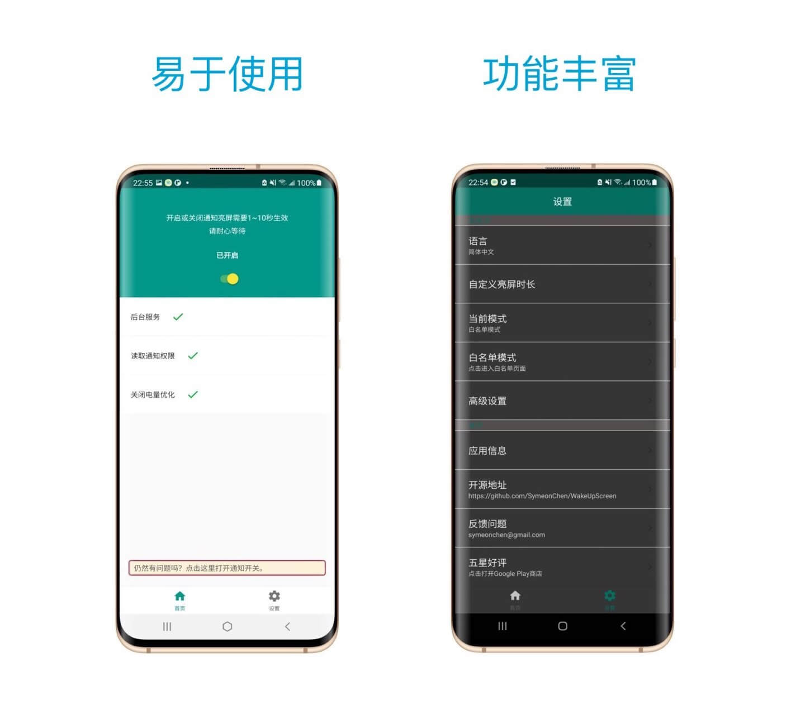

* [English Version](https://github.com/SymeonChen/WakeUpScreen/blob/master/README.md)
* [Italian Version](https://github.com/SymeonChen/WakeUpScreen/blob/master/README-it.md)
* [中文版](https://github.com/SymeonChen/WakeUpScreen/blob/master/README-zh.md)

# 通知亮屏（WakeUpScreen）

 
这是一个可以使手机在接收到通知时点亮屏幕的 Android APP。
特别为三星s10优化，同样兼容其他设备。
 

  

## 截图

## 特点

1. 开源
2. 无需网络连接
3. 支持口袋模式
4. 支持分应用过滤
5. 支持自定义亮屏时间