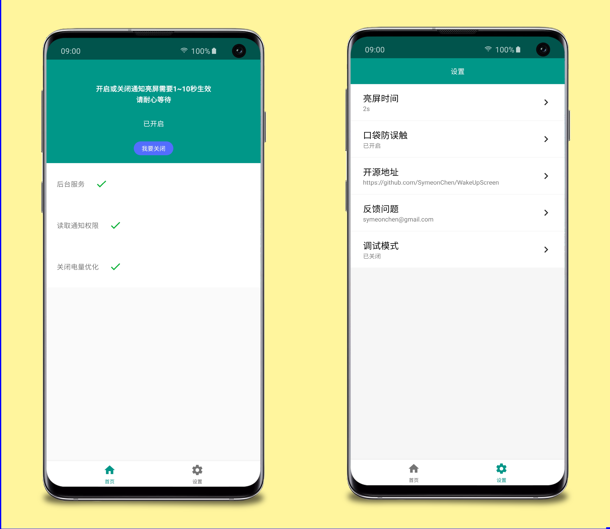

* [English Version](https://github.com/SymeonChen/WakeUpScreen/blob/master/README.md)
* [中文版](https://github.com/SymeonChen/WakeUpScreen/blob/master/README-zh.md)

# WakeUpScreen

This is an Android app that allows the phone to **wake up** when it receives a **notification**.

## Introductions

### Application screenshot

### Why am I developing this project?

The ability to wake up the screen when notified is a feature that is integrated in most Android third-party systems, but until now there are still popular devices that do not support this feature, such as the Samsung S series and Note series models equipped with OneUI. For me, the lack of this feature greatly affects the daily experience, so the application will continue to be maintained until Samsung officially launches the feature.

### What is the difference between this project and other competing products?

In the Android system, **read notifications for all apps** is a special privilege, given the privacy and security considerations, I can not trust those **non-open source application** and **have network access** applications, so decided to implement it by myself. The application insists:

1. Open source.
2. No internet access.

### What other features?

#### Completed features:

1. Custom screen wake-up time, such as 1 second, 2 seconds, 5 seconds
2. Pocket mode，When the phone is in the pocket, it will not wake up the screen even if notified.
3. Multi-language adaptation

#### Features in development:

1. Application filtering
2. Quick switch
