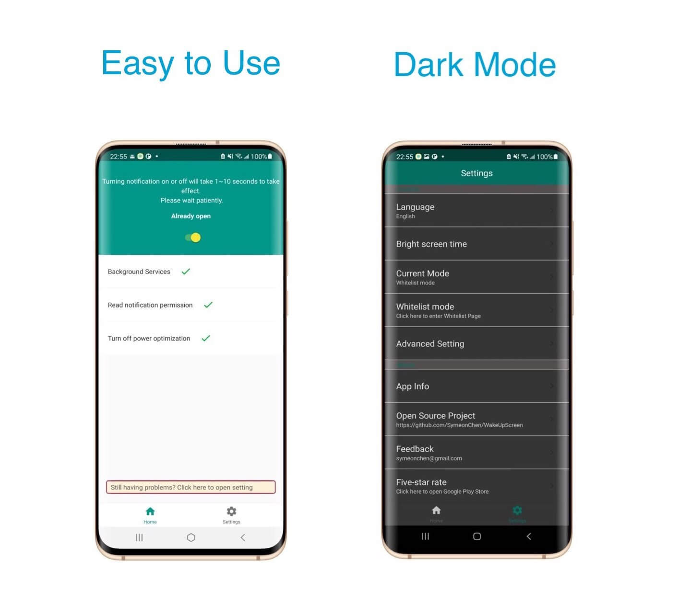

* [English Version](https://github.com/SymeonChen/WakeUpScreen/blob/master/README.md)
* [Italian Version](https://github.com/SymeonChen/WakeUpScreen/blob/master/README-it.md)
* [中文版](https://github.com/SymeonChen/WakeUpScreen/blob/master/README-zh.md)

# WakeUpScreen

 
This is an Android app that allows the phone to wake up when it receives a notification.
Specially for Samsung S10 optimization. Also compatible with other devices.
 

  

## Screenshots

## Features

1. Open source.
2. No internet access required.
3. Support Pocket Mode.
4. Support for custom APP lists.
5. Support dark mode.
6. More...